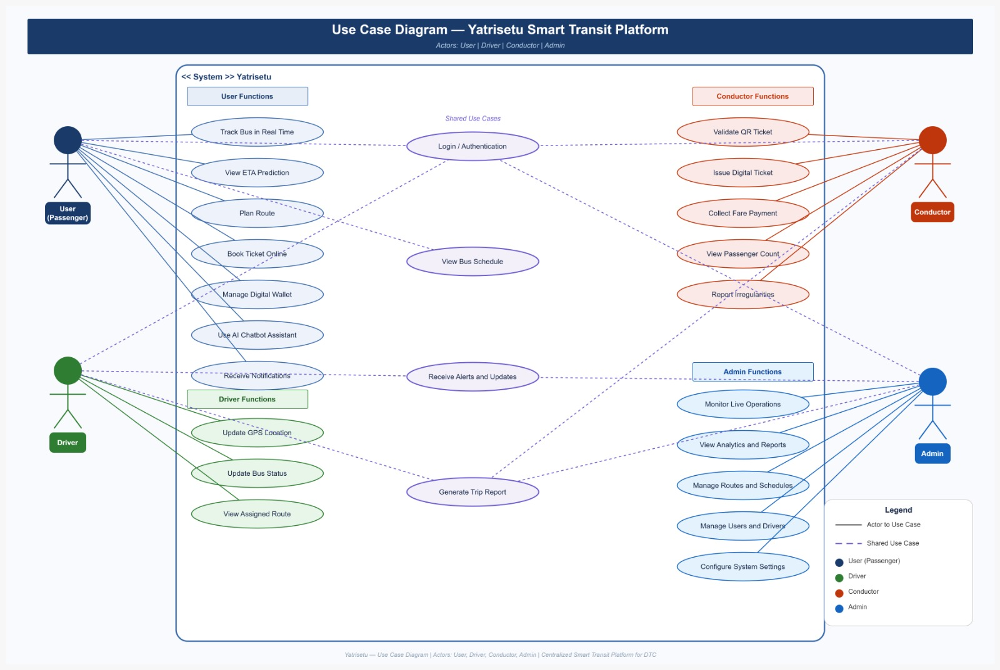

# Use Case Diagram - YatriSetu Smart Transit Platform

## Overview

This document describes the use case diagram for the YatriSetu Smart Transit Platform, illustrating the interactions between different actors and the system functionalities.

## Diagram

## Actors

The system supports four primary actor types:

| Actor | Description | Color Code |
|-------|-------------|------------|
| User (Passenger) | End users who book tickets and track buses | Blue |
| Driver | Bus drivers who update location and status | Green |
| Conductor | Bus conductors who validate tickets and collect fares | Red/Orange |
| Admin | System administrators who manage operations | Blue |

## Use Cases by Actor

### User (Passenger) Functions

| Use Case | Description | Type |
|----------|-------------|------|
| Track Bus in Real Time | View live bus location and ETA | Primary |
| View ETA Prediction | Check estimated arrival time at stops | Primary |
| Plan Route | Find optimal routes between locations | Primary |
| Book Ticket Online | Purchase bus tickets digitally | Primary |
| Manage Digital Wallet | Add funds and manage wallet balance | Primary |
| Use AI Chatbot Assistant | Get route assistance and information | Primary |
| Receive Notifications | Get alerts about bus status and updates | Shared |

### Driver Functions

| Use Case | Description | Type |
|----------|-------------|------|
| Update GPS Location | Continuously update bus location | Primary |
| Update Bus Status | Report bus operational status | Primary |
| View Assigned Route | Check assigned route details | Primary |
| Receive Alerts and Updates | Get notifications about route changes | Shared |

### Conductor Functions

| Use Case | Description | Type |
|----------|-------------|------|
| Validate QR Ticket | Scan and validate passenger tickets | Primary |
| Issue Digital Ticket | Generate tickets for on-board passengers | Primary |
| Collect Fare Payment | Process cash and digital payments | Primary |
| View Passenger Count | Monitor current passenger load | Primary |
| Report Irregularities | Report issues or incidents | Primary |
| Receive Alerts and Updates | Get notifications about operations | Shared |

### Admin Functions

| Use Case | Description | Type |
|----------|-------------|------|
| Monitor Live Operations | Track all buses in real-time | Primary |
| View Analytics and Reports | Access system performance metrics | Primary |
| Manage Routes and Schedules | Configure routes and timetables | Primary |
| Manage Users and Drivers | Administer user accounts and permissions | Primary |
| Configure System Settings | Adjust system parameters and settings | Primary |

## Shared Use Cases

These use cases are accessible by multiple actors:

| Use Case | Actors | Description |
|----------|--------|-------------|
| Login / Authentication | All | Secure system access |
| Receive Alerts and Updates | User, Driver, Conductor | System notifications |
| View Bus Schedule | User, Driver | Access timetable information |
| Generate Trip Report | Driver, Admin | Create trip summaries |

## Use Case Relationships

### Include Relationships

| Base Use Case | Included Use Case |
|---------------|-------------------|
| All functions | Login / Authentication |
| Track Bus in Real Time | View Bus Schedule |
| Plan Route | View ETA Prediction |

### Extend Relationships

| Base Use Case | Extended Use Case |
|---------------|-------------------|
| Book Ticket Online | Manage Digital Wallet |
| Collect Fare Payment | Issue Digital Ticket |

## Functional Categories

### User-Facing Features

| Category | Use Cases |
|----------|-----------|
| Real-time Tracking | Track Bus in Real Time, View ETA Prediction |
| Journey Planning | Plan Route, View Bus Schedule |
| Ticketing | Book Ticket Online, Manage Digital Wallet |
| Assistance | Use AI Chatbot Assistant, Receive Notifications |

### Operational Features

| Category | Use Cases |
|----------|-----------|
| Driver Operations | Update GPS Location, Update Bus Status, View Assigned Route |
| Conductor Operations | Validate QR Ticket, Issue Digital Ticket, Collect Fare Payment |
| Monitoring | View Passenger Count, Report Irregularities |

### Administrative Features

| Category | Use Cases |
|----------|-----------|
| Operations Management | Monitor Live Operations, View Analytics and Reports |
| Configuration | Manage Routes and Schedules, Configure System Settings |
| User Management | Manage Users and Drivers |

## System Boundaries

The use case diagram defines the following system boundaries:

| Boundary | Components |
|----------|------------|
| User Functions | Passenger-facing features and services |
| Driver Functions | Driver-specific operational tools |
| Conductor Functions | Conductor-specific operational tools |
| Admin Functions | Administrative and management features |
| Shared Functions | Cross-actor authentication and notifications |

## Implementation Status

| Use Case | Status | Priority |
|----------|--------|----------|
| Track Bus in Real Time | Implemented | High |
| View ETA Prediction | Planned | High |
| Plan Route | Implemented | High |
| Book Ticket Online | Implemented | High |
| Manage Digital Wallet | Implemented | High |
| Use AI Chatbot Assistant | Implemented | High |
| Validate QR Ticket | Planned | Medium |
| Issue Digital Ticket | Planned | Medium |
| Update GPS Location | Implemented | High |
| Monitor Live Operations | Implemented | High |
| View Analytics and Reports | Implemented | High |
| Manage Routes and Schedules | Implemented | Medium |

## Security Considerations

| Actor | Authentication Level | Access Control |
|-------|---------------------|----------------|
| User (Passenger) | Standard | Limited to personal data and public information |
| Driver | Enhanced | Access to assigned route and bus data |
| Conductor | Enhanced | Access to ticketing and passenger data |
| Admin | Maximum | Full system access with audit logging |

## Integration Points

| Use Case | External Systems |
|----------|------------------|
| Track Bus in Real Time | GPS/Location Services |
| Manage Digital Wallet | Payment Gateway |
| Receive Notifications | SMS/Email/Push Notification Services |
| View Analytics and Reports | Business Intelligence Tools |

## Future Enhancements

| Enhancement | Description | Target Actors |
|-------------|-------------|---------------|
| Multi-language Support | Support for Hindi and regional languages | All Users |
| Voice Commands | Voice-based chatbot interaction | Users |
| Predictive Maintenance | AI-based bus maintenance alerts | Admin, Driver |
| Dynamic Pricing | Surge pricing during peak hours | Users, Admin |
| Social Features | Share routes and travel plans | Users |

## Related Documentation

| Document | Description |
|----------|-------------|
| [PROJECT_STRUCTURE.md](PROJECT_STRUCTURE.md) | System architecture overview |
| [CHATBOT_QUICK_REFERENCE.md](CHATBOT_QUICK_REFERENCE.md) | AI Chatbot features |
| [LIVE_TRACKING_FEATURE.md](LIVE_TRACKING_FEATURE.md) | Real-time tracking implementation |
| [TESTING_GUIDE.md](TESTING_GUIDE.md) | Testing procedures for use cases |

## Diagram Legend

| Symbol | Meaning |
|--------|---------|
| Solid Line | Actor to Use Case relationship |
| Dashed Line | Shared Use Case relationship |
| Oval | Use Case |
| Stick Figure | Actor |
| Rectangle | System Boundary |

## Notes

- The diagram follows UML 2.5 notation standards
- All use cases are designed with user experience as the primary focus
- Security and authentication are implicit in all actor interactions
- The system is designed for scalability and future enhancements

## Version History

| Version | Date | Changes |
|---------|------|---------|
| 1.0 | February 2026 | Initial use case diagram |

---

**Document Status:** Current  
**Last Updated:** February 2026  
**Maintained By:** YatriSetu Development Team
